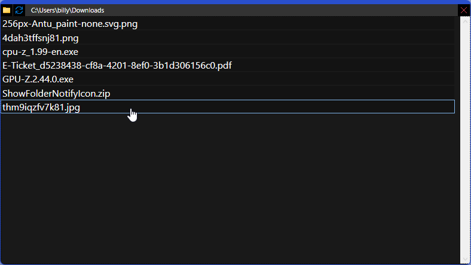
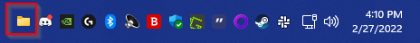

# ShowFolderNotifyIcon

## About
Have you ever wanted to quickly view and get at the contents of a folder? This application gives you that ability. For example, you could quickly look at and open files in your Downloads folder after having downloaded something.

## How to install
Click on "(number) Release" above and download ShowFolderNotifyIcon.msi. Double click on the file once downloaded and follow the instructions to install the program. ShowFolderNotifyIcon is for 64-bit (x64) Windows PCs only.

**Notes:**
* The program will automatically add itself to Windows startup, you can easily disable it from starting with Windows in the Task Manager's Startup tab.
* If prompted to download the .NET Runtime, make sure to download "Run desktop apps" version.

## How to use
* The program will default to using your Downloads folder.
* To change the folder viewed, click the folder icon in the top-left.
* To refresh the current view, click the blue refresh icon.
* To close the current view, click the red close icon in the top-right. The program will keep running as an icon in your taskbar notification section.
* To re-open the view, simply click on the folder icon in the taskbar notification section. You can click it again to hide the view.
* To stop the program, right click the taskbar folder icon, and select "Close".
* When you click on a file/folder listed, it will open Explorer with the file highlighted.

